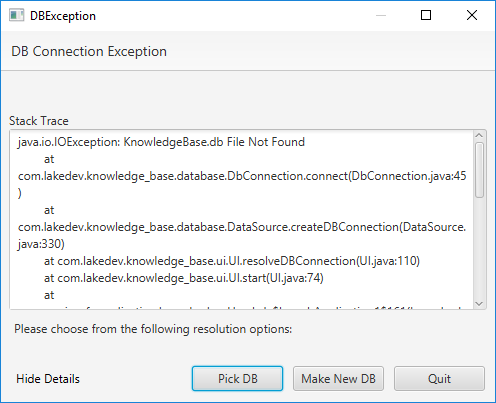
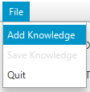
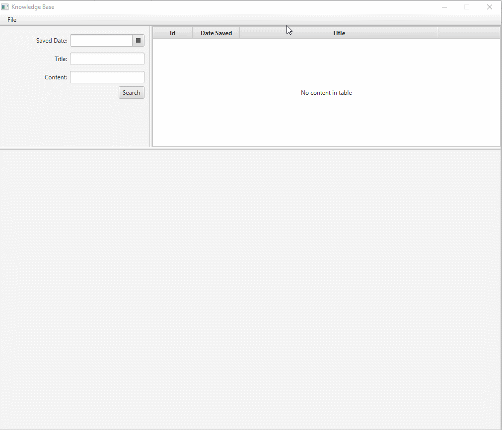
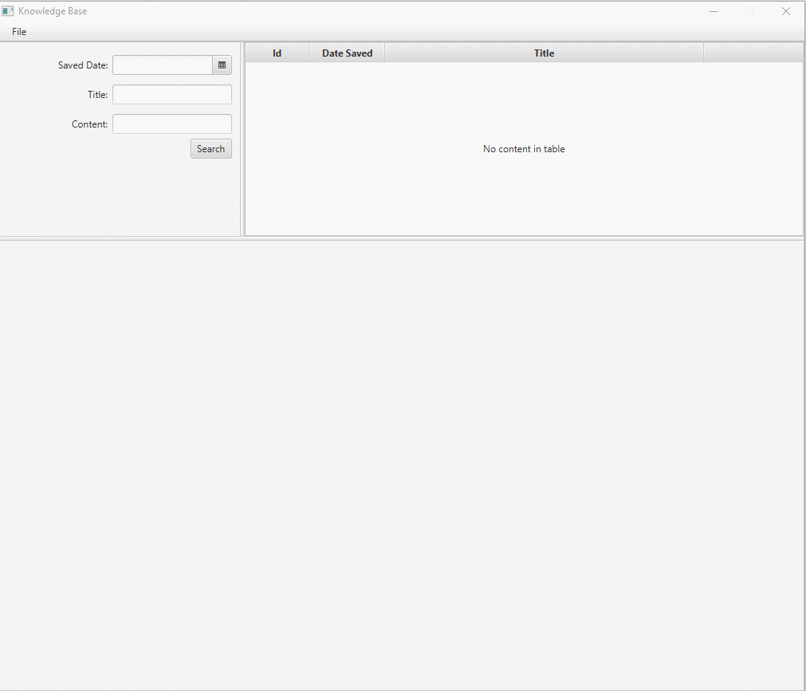
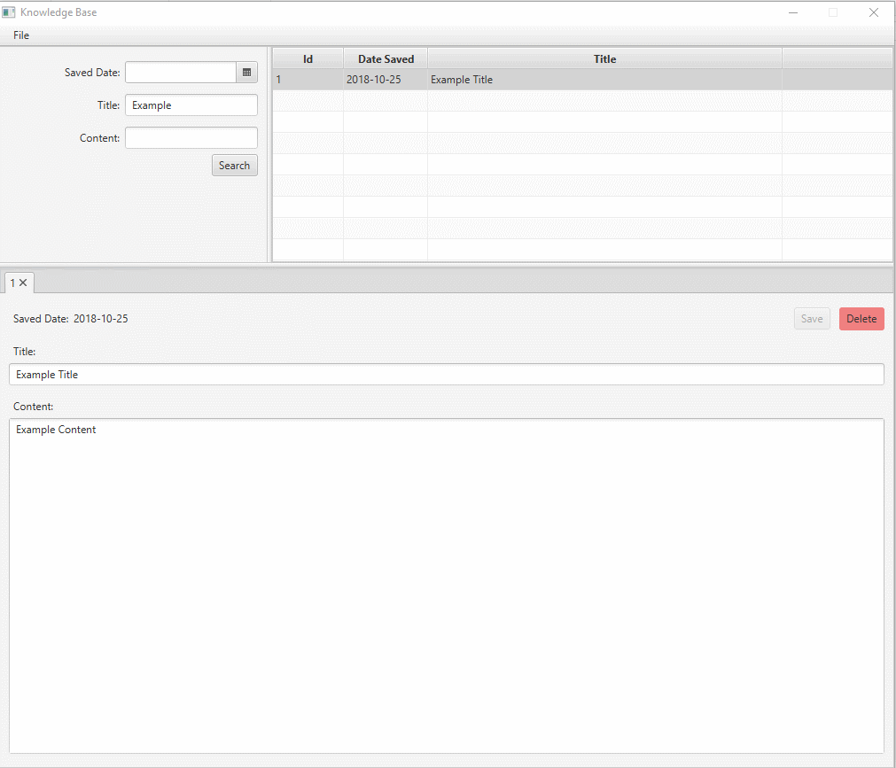
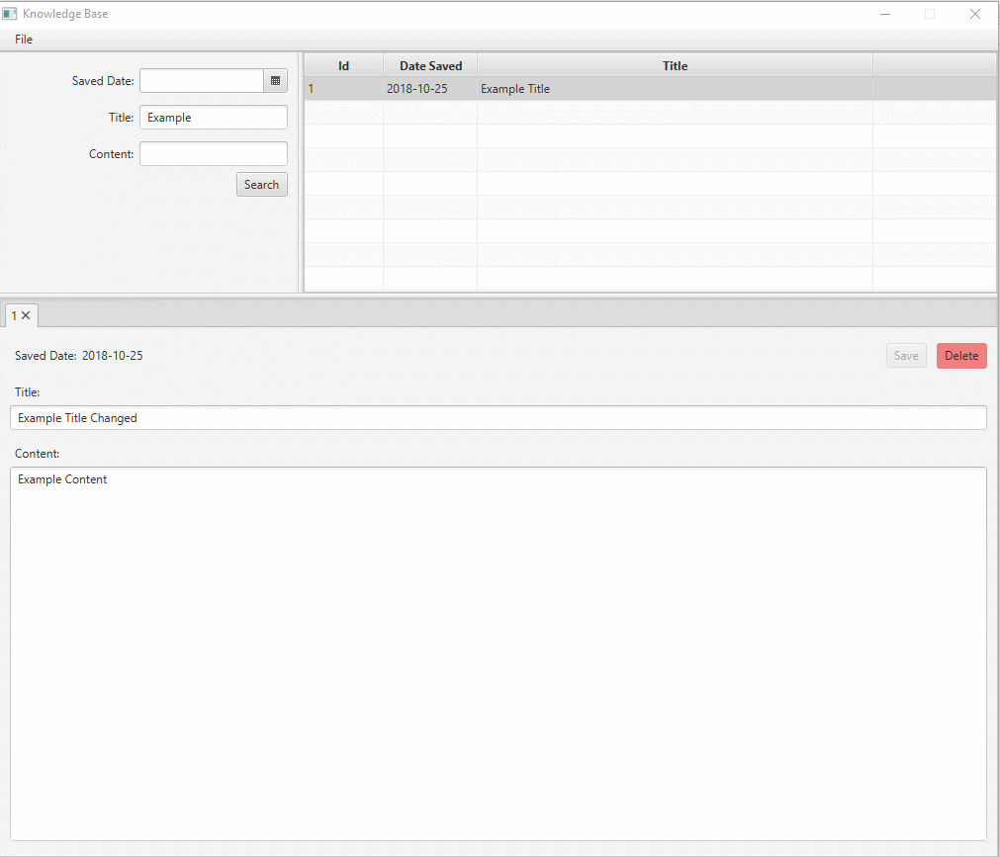

# KnowledgeBase
A Small JavaFx program for saving your knowledge in a local sqlite database. Created for a final project.

## Usage

1. Download the latest release.
2. Double click the .jar to open KnowledgeBase.

### Connecting

1. If you don't have a database already or there was an issue connecting to it, you will see the following dialog:

  
  
- Select 'Pick DB' to select an existing KnowledgeBase Database to connect to, 
- or Select 'Make New DB' to create a new database in the current directory.

### Adding Knowledge

1. Add some knowledge via File -> Add Knowledge

  
  
2. In the resulting tab, add a title, some content, and click 'Save'.

  
  
### Search Existing Knowledge

1. Provide either a saved date, title, or content and click "Search". Note that you can use more than one option at once.

2. In the results area, double click a result to view it.

  

*TIP* If you search for '%' in either the 'title' or 'content' fields, you will gather all the entries in the database.

### Editing Existing Knowledge

1. Search for the knowledge you want to edit and open it.

2. Make your changes, and then click 'Save' to save them.

  
  
### Deleting Knowledge
  
1. Search for the knowledge you'd like to delete and open it. 

2. Click the 'Delete' button in the upper right of the knowledge view.

  
